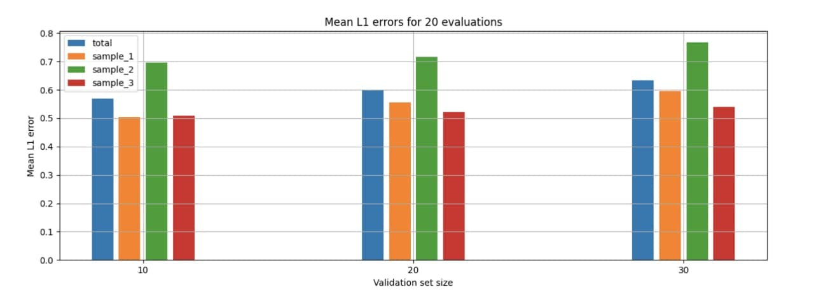
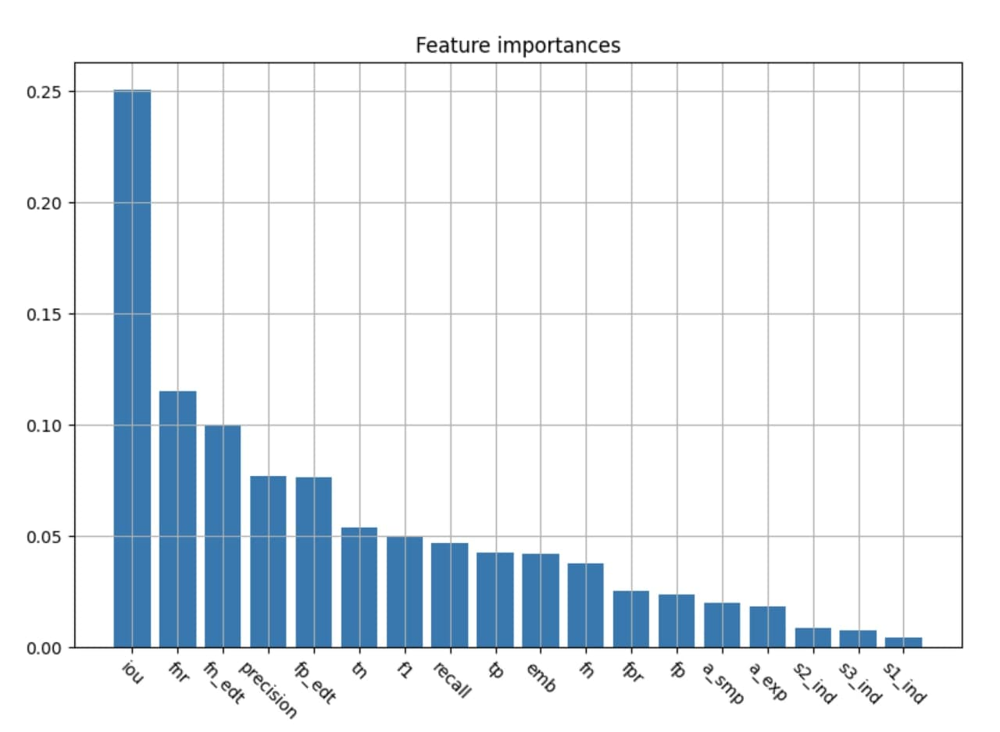

Основной идеей метода является построение фич и применение Random forest для предсказания оценки. В качестве итоговых характеристик используются:
* IoU
* Precision
* Recall
* F1-score
* False Positive Rate
* False Negative Rate
* Confusion Matrix
* Non-negative mask areas
* Euclidian Distance Transform

Дополнительно в качестве характеристик использовались латентные векторы, полученные от автоэнкодера, обученного на восстановление геометрических фигур, представленных на масках сегментаций.

На основе этих характеристик обучается ансамбль деревеьев решенией (RandomForestRegressor из библиотеки scikit-learn). Были проведены эксперименты и с другими моделями, например, MLPRegressor, BaggingRegressor, AdaBoostRegressor, однако они были подвержены переобучению. 

Полученные значения ошибки L1 представлены на графике ниже. Для получениях этих значений мы повторяли цикл обучения и валидации 20 раз, каждый раз выбирая новую обучающую и валидационную выборки. После этого мы усреднили полученные значения ошибок L1.

RandomForestRegressor позволяет получить веса для использованных в обучении характеристик. Эти значения представлены на графике ниже.

*main.py*: основной файл, в котором реализована логика обучения и валидации. 

Для запуска подсчета результатов необходимо выполнить:

*python main.py path_to_dataset*

dataset_path -- пусть к папке Dataset, предоставленная организаторами. Также в этой папке должен находится файл *SecretPart_dummy.csv* с шаблоном выхода.

*utils.py*: содержит различиные вспомогательные функции, например, считывание данных, посчет метрик, разделение датасета на обучающую и валидационные выборки 

*misc.py*: содержит посторонние функции, например, для просмотра датасета, сохранения графиков для презентации 

Файл NibbersSubmission.csv с результатми скрипта будет лежать в корневой папке проекта

*recurrent_autoencoder.ipynb*: содержит код для обучения и построения фич с помощью рекуррентного автоэнкодера. Автоэнкодер обучается восстанавливать данные о сегментации из файла DX_TEST_RESULT_FULL.csv, в качестве feature вектора используется выходное состояние энкодера.

*cnn_autoencoder.ipynb*: содержит аналогичный код для сверточного автоэнкодера. Модель в данном случае работает напрямую с исходными изображениями и масками сегментации, уменьшенными до размерешения 16х16.